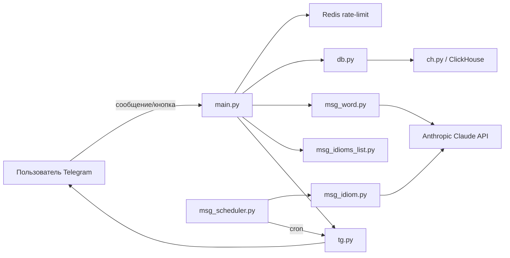

# 🤖 English Idioms & Words Telegram Bot

Telegram-бот на Python, который ежедневно присылает подписчикам английские идиомы и умеет по запросу находить значения слов, переводы, примеры употребления и связанные идиомы. Контент генерируется через Anthropic Claude API, данные хранятся в ClickHouse.

## Возможности

- 📅 Ежедневная рассылка идиомы по расписанию (APScheduler)
- 🔤 Поиск слова: значение, транскрипция, произношение, переводы (ru/uk/ge), примеры
- 📖 Идиомы, содержащие конкретное слово — по кнопке под карточкой слова
- 🧠 Генерация постов через Claude (включая веб-поиск для происхождения идиомы и аналогов)
- 🛡️ Rate-limiting запросов пользователя (Redis, sliding window log)
- 💾 История отправленных идиом и запрошенных слов — повторные запросы отдаются из кэша БД

## Стек

| Назначение | Технология |
|---|---|
| Telegram Bot API | `pyTelegramBotAPI` |
| LLM | Anthropic Claude (`anthropic`) |
| БД | ClickHouse (`clickhouse-connect`) |
| Кэш / rate-limit | Redis |
| Планировщик | APScheduler |
| Конфигурация | `pydantic-settings` |
| Эмбеддинги (загрузка данных) | VoyageAI |

## Структура проекта

```
.
├── main.py               # Точка входа: хендлеры Telegram, rate-limit, инлайн-клавиатуры
├── config.py             # Settings (pydantic-settings) — чтение переменных окружения из .env
├── db.py                 # Db — доступ к данным: пользователи, слова, идиомы, история
├── ch.py                 # Ch — низкоуровневый клиент ClickHouse (query/insert/execute)
├── tg.py                 # Инициализация TeleBot, отправка сообщений одному/всем пользователям
├── msg_word.py            # Сбор данных о слове из БД + ранжирование значений и генерация карточки через Claude
├── msg_idiom.py          # Генерация поста об идиоме дня через Claude (с веб-поиском)
├── msg_idioms_list.py     # Форматирование списка идиом по слову (кнопка "Idioms with the word")
├── msg_scheduler.py       # Cron-задача APScheduler: ежедневная рассылка идиомы всем пользователям
├── add_data/             # Скрипты разовой загрузки/обработки данных в ClickHouse
│   ├── idioms.py         # Импорт идиом из JSON + эмбеддинги VoyageAI
│   ├── words.py          # Импорт словарных статей батчами
│   └── words_clean.py    # Ранжирование/очистка значений слов через Claude
├── Dockerfile            # Образ на python:3.13-slim, запуск от непривилегированного пользователя
├── requirements.txt      # Зависимости проекта
└── test.py               # Черновик/тестовый скрипт
```

## Архитектура (поток данных)



## База данных

Раздел в разработке

## Настройка окружения

Создайте `.env` в корне проекта:

```env
ANTHROPIC_TOKEN=
TELEGRAM_TOKEN=
IDIOMS_SCHEDULE_TIME=      # час отправки идиомы дня (0-23)

CH_HOST=
CH_PSW=

VOYAGE_TOKEN=

RATE_LIMIT_MAX_REQUESTS=
RATE_LIMIT_WINDOW_SECONDS=

REDIS_HOST=
REDIS_PSW=
```

## Запуск

### Локально
```bash
pip install -r requirements.txt
python main.py
```

### Docker
```bash
docker build -t idioms-bot .
docker run --env-file .env idioms-bot
```

## Основные команды бота

| Действие | Описание |
|---|---|
| `/start` | Приветствие + первая идиома из истории |
| Сообщение с английским словом (a-z, до 15 символов) | Карточка слова: транскрипция, значения, переводы, примеры |
| Кнопка "Idioms with the word" | Список идиом, содержащих слово |
